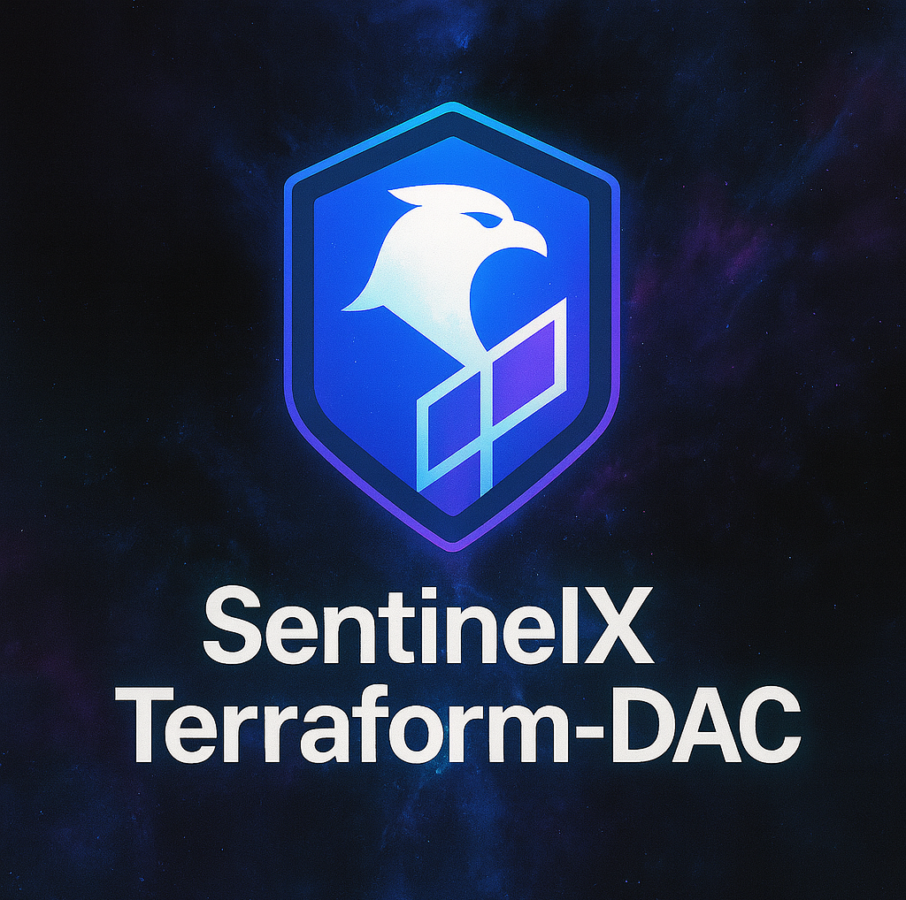
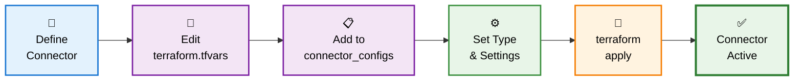
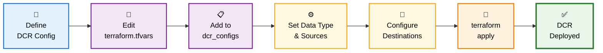
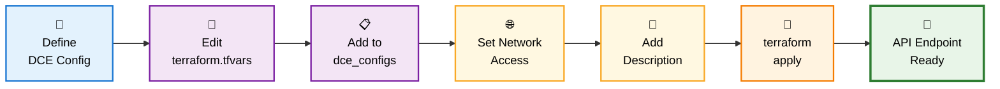
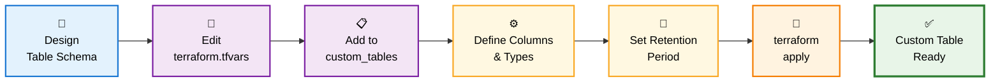
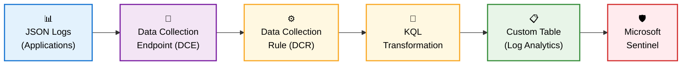
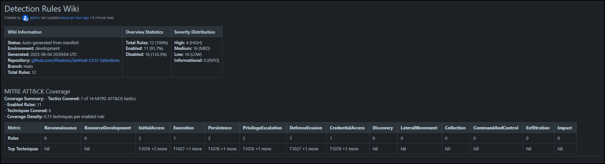
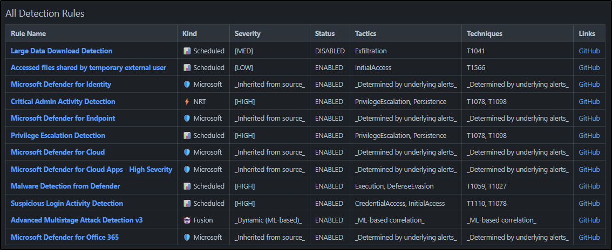

<div align="center">
  
  
  # SentinelDaC - Detection as Code Framework
  
  *A comprehensive, modular Detection as Code framework for Microsoft Sentinel*
</div>

---

## 📑 Table of Contents

- [🚀 Key Highlights](#-key-highlights)
- [🛠️ Getting Started](#%EF%B8%8F-getting-started)
  - [Prerequisites & Setup](#prerequisites--setup)
  - [Azure Infrastructure Setup](#azure-infrastructure-setup)
  - [Terraform Cloud Configuration](#terraform-cloud-configuration)
  - [Repository Configuration](#repository-configuration)
- [🏗️ Architecture](#%EF%B8%8F-architecture)
- [🎯 Framework Overview](#-framework-overview)
- [🚀 Framework Status](#-framework-status)
  - [📊 Current Deployment Stats](#-current-deployment-stats)
- [🔧 Configuration](#-configuration)
  - [Terraform Cloud Integration](#terraform-cloud-integration)
  - [Infrastructure Dependencies](#infrastructure-dependencies)
- [📋 Quick Start](#-quick-start)
- [🏗️ Component Workflow Diagrams](#%EF%B8%8F-component-workflow-diagrams)
  - [🔗 Adding a New Data Connector](#-adding-a-new-data-connector)
  - [📊 Adding a New Data Collection Rule (DCR)](#-adding-a-new-data-collection-rule-dcr)
  - [🚪 Adding a New Data Collection Endpoint (DCE)](#-adding-a-new-data-collection-endpoint-dce)
  - [🔍 Adding a Parser for Data Collection Rules](#-adding-a-parser-for-data-collection-rules)
- [🔄 Data Collection Rules (DCRs) & Logs Ingestion API](#-data-collection-rules-dcrs--logs-ingestion-api)
- [🛡️ Auto-Generated Detection Wiki](#%EF%B8%8F-auto-generated-detection-wiki)
  - [🎨 Live Wiki Screenshots](#-live-wiki-screenshots)
  - [📋 Watchlist Structure](#-watchlist-structure)
- [🔒 Security Considerations](#-security-considerations)
- [📈 Environment Strategy](#-environment-strategy)

## 🚀 Key Highlights

- 🏗️ **11 Core Components**: Detection rules (Scheduled, NRT, Microsoft), automation rules, watchlists, playbooks, custom tables, data collection (DCEs/DCRs), data connectors, threat intel rules
- 🎯 **Framework Scope**: Focuses on Terraform-manageable components for programmatic control
- 🚀 **Modular Architecture**: Individual modules in `modules/` directories with comprehensive documentation
- 📋 **Content Management**: Individual YAML files in `content/` directories for granular control
- ⚙️ **Single Configuration**: Simplified `terraform.tfvars` approach for easy management
- 📚 **Auto-Generated Documentation**: Comprehensive Detection Wiki with MITRE ATT&CK mapping
- 🔗 **Data Collection Endpoints**: API ingestion capabilities similar to Splunk HEC
- 📊 **Remote State Management**: Terraform Cloud integration with cross-workspace dependencies

## 🛠️ Getting Started

### Prerequisites & Setup

Before deploying the SentinelDaC framework, you'll need to complete the following setup steps:

#### **1. Azure Infrastructure Setup**

**Create Core Azure Resources:**
```bash
# 1. Create Azure Subscription (if needed)
# Use Azure Portal or contact your Azure administrator

# 2. Create Resource Group
az group create --name "rg-sentinel-yourenv" --location "Australia East"

# 3. Create Log Analytics Workspace
az monitor log-analytics workspace create --resource-group "rg-sentinel-yourenv" --workspace-name "law-sentinel-yourenv" --location "Australia East" --sku "PerGB2018"

# 4. Enable Microsoft Sentinel
az sentinel workspace create --resource-group "rg-sentinel-yourenv" --workspace-name "law-sentinel-yourenv"
```

#### **2. Service Principal for Terraform**

**Create App Registration & Service Principal:**
```bash
# 1. Create App Registration
az ad app create --display-name "terraform-sentineldac-yourenv" --query "appId" -o tsv
# Save the returned Application ID

# 2. Create Service Principal
az ad sp create --id "YOUR_APPLICATION_ID_FROM_STEP_1"

# 3. Generate Client Secret
az ad app credential reset --id "YOUR_APPLICATION_ID" --display-name "terraform-secret" --query "password" -o tsv
# Save the returned secret securely

# 4. Assign Contributor Permissions to Resource Group
az role assignment create --assignee "YOUR_APPLICATION_ID" --role "Contributor" --scope "/subscriptions/YOUR_SUBSCRIPTION_ID/resourceGroups/rg-sentinel-yourenv"

# 5. Assign Sentinel Contributor Permissions
az role assignment create --assignee "YOUR_APPLICATION_ID" --role "Microsoft Sentinel Contributor" --scope "/subscriptions/YOUR_SUBSCRIPTION_ID/resourceGroups/rg-sentinel-yourenv"
```

#### **3. Terraform Cloud Configuration**

**Set up Terraform Cloud (Free for up to 5 users):**

1. **Create Account**: Sign up at [https://app.terraform.io](https://app.terraform.io)
2. **Create Organization**: Choose a unique organization name
3. **Create Workspace**: 
   - Choose "Version control workflow"
   - Connect your forked GitHub repository
   - Name your workspace (e.g., `sentinel-content-yourenv`)

**Configure Environment Variables** (mark as Sensitive):
```
ARM_CLIENT_ID       = "your-service-principal-application-id"
ARM_CLIENT_SECRET   = "your-service-principal-secret"
ARM_SUBSCRIPTION_ID = "your-azure-subscription-id"
ARM_TENANT_ID       = "your-azure-tenant-id"
```

#### **4. Repository Configuration**

**Fork and Configure Repository:**
```bash
# 1. Fork this repository to your GitHub account

# 2. Clone your fork
git clone https://github.com/YOUR_USERNAME/SentinelxTerraformDaC.git
cd SentinelxTerraformDaC

# 3. Update terraform.tfvars with your values
# See SECURITY-SETUP.md for secure configuration guidance

# 4. Update main.tf with your Terraform Cloud organization
# Replace "Kaibersec" with your organization name
```

**Required terraform.tfvars Configuration:**
```hcl
# Infrastructure Settings - Update with your values
subscription_id              = "[YOUR_AZURE_SUBSCRIPTION_ID]"
resource_group_name          = "rg-sentinel-yourenv"
log_analytics_workspace_name = "law-sentinel-yourenv"

# Environment Configuration
environment = "dev"  # or "staging", "prod"

# Feature Toggles
enable_scheduled_rules     = true
enable_nrt_rules           = true
enable_microsoft_rules     = true
enable_playbooks           = true
enable_hunting_queries     = true
enable_automation_rules    = true
enable_watchlists          = true
enable_data_collection     = true
enable_data_connectors     = true
```

#### **5. GitHub Secrets Setup**

**For PowerShell Scripts & CI/CD** (See `SECURITY-SETUP.md` for details):
```
AZURE_TENANT_ID
AZURE_SUBSCRIPTION_ID  
AZURE_CLIENT_ID
AZURE_CLIENT_SECRET
```

#### **6. Initial Deployment**

```bash
# 1. Commit your configuration changes
git add terraform.tfvars
git commit -m "Initial configuration for my environment"
git push origin main

# 2. Terraform Cloud will automatically trigger a plan
# Review the plan in the Terraform Cloud UI

# 3. Approve the apply in Terraform Cloud UI
# This will deploy all 11 framework components

# 4. Verify deployment in Azure Portal
# Check Microsoft Sentinel > Analytics rules, Automation rules, etc.
```

#### **7. Pipeline setup**

You'll need to open up each of the pipelines and adjust the scheduling also if you want them to run as a cron job.

`.github\workflows\detection-wiki-generator.yml`
`.github\workflows\pull-request-sentinel-templates.yml`

This one is manually triggered though, once a pull request is accepted from the detection wiki generator. You would run this to push it to Confluence. Feel free to automate it though if the appetite is there.
`.github\workflows\push-wiki-to-confluence.yml`

#### **8. Post-Deployment Verification**

```powershell
# Test data ingestion (optional)
.\scripts\post-events-to-dce.ps1 -ClientSecret $env:AZURE_CLIENT_SECRET -ShowBody

# Generate detection wiki
.\scripts\generate-detection-wiki-clean.ps1

# Validate in Azure Portal:
# - Analytics Rules: Should see 10 detection rules
# - Automation Rules: Should see 1 active rule
# - Watchlists: Should see 3 lists with data
# - Custom Tables: Should see 11 custom tables
```

**🎉 Congratulations!** Your SentinelDaC framework is now deployed and ready for customization.

**Next Steps:**
- Review the [Quick Start](#-quick-start) section for common operations
- Explore [Component Workflow Diagrams](#%EF%B8%8F-component-workflow-diagrams) for adding new content
- Check the [Auto-Generated Detection Wiki](#%EF%B8%8F-auto-generated-detection-wiki) for documentation

## 🏗️ Architecture

```
SentinelxTerraform-DaC/
├── modules/                    # Reusable Terraform modules
│   ├── analytics-rules/        # Scheduled analytics rules module ✅
│   ├── nrt-rules/             # Near Real Time rules module ✅
│   ├── microsoft-rules/       # Microsoft security rules module ✅
│   ├── automation-rules/      # Automation rules module ✅
│   ├── watchlists/           # Watchlists module ✅
│   ├── playbooks/            # Logic Apps (playbooks) module ✅
│   ├── hunting-queries/      # Hunting queries module ✅
│   ├── custom-tables/        # Custom Log Analytics tables module ✅
│   ├── data-collection/      # Data Collection Rules & Endpoints module ✅
│   ├── data-connectors/      # Data connectors module ✅
│   └── threat-intel-rules/   # Threat intelligence rules module ✅
├── content/                   # Detection content definitions
│   ├── scheduled-rules/       # 5 scheduled analytics rules (YAML)
│   ├── nrt-rules/            # 1 near real-time rule (YAML)
│   ├── microsoft-rules/       # 5 Microsoft security rules (YAML)
│   ├── automation-rules/      # 1 automation rule + 2 disabled (YAML)
│   ├── watchlists/           # 3 watchlists (metadata YAML + CSV data files)
│   ├── playbooks/            # 3 active playbooks (YAML)
│   └── hunting-queries/      # 1 active hunting query (YAML)
├── scripts/                   # PowerShell deployment & validation scripts
├── DetectionWiki/            # Auto-generated detection documentation ✅
│   ├── DetectionWiki.md      # Comprehensive rule documentation with MITRE ATT&CK mapping
│   └── wiki-metadata.json   # Wiki generation metadata and statistics
├── .github/workflows/        # CI/CD pipelines for automation ✅
│   ├── generate-detection-wiki-clean.ps1  # Wiki generation script
│   └── detection-wiki-generator.yml       # Automated wiki generation workflow
├── *.tf                       # Terraform configuration files
└── terraform.tfvars          # Single configuration file
```

## 🎯 Framework Overview

This framework follows core principles of modularity, scalability, and centralised variable management to enable efficient deployment and management of Microsoft Sentinel detection content. The framework focuses on **11 core components** that are natively manageable through Terraform, providing programmatic control over detection and response capabilities.

### 🎯 Framework Scope

**Terraform-Managed Components (Active):**
1. **Scheduled Rules** - Custom analytics rules with KQL queries (`analytics-rules` module)
2. **NRT Rules** - Near Real Time detection rules (`nrt-rules` module)
3. **Microsoft Rules** - Microsoft security product integration rules (`microsoft-rules` module)
4. **Automation Rules** - Incident assignment and response automation (`automation-rules` module)
5. **Watchlists** - Threat intelligence and reference data lists (`watchlists` module)
6. **Playbooks** - Logic Apps for automated response workflows (`playbooks` module)
7. **Hunting Queries** - Proactive threat hunting queries (`hunting-queries` module)
8. **Custom Tables** - Log Analytics custom tables for data ingestion (`custom-tables` module)
9. **Data Collection** - Data Collection Rules (DCRs) and Endpoints (DCEs) for log ingestion (`data-collection` module)
10. **Data Connectors** - Third-party and Microsoft service integrations (`data-connectors` module)
11. **Threat Intel Rules** - Threat intelligence correlation rules (`threat-intel-rules` module)

**Architectural Decision:**
The framework focuses on components that provide the best Terraform integration experience and are most suitable for programmatic management through Infrastructure as Code principles.

## 🚀 Framework Status

### 📊 What this environment builds
- **Detection Rules**: 10 active *(5 scheduled + 1 NRT + 5 Microsoft)*
- **Automation Rules**: 1 active *(2 disabled)*  
- **Watchlists**: 3 active with CSV data
- **Playbooks**: 3 active *(PowerShell, Python, Logic App)*
- **Hunting Queries**: 1 active
- **Custom Tables**: 11 active *(SecurityEvents_CL, MinimalLogs_CL + 8 ASIM schema tables)*
- **Data Collection Rules**: 11 active *(Linux syslog, Windows security, API security events + 8 ASIM schema DCRs)*
- **Data Collection Endpoints**: 2 active *(API ingestion, private ingestion)*
- **Data Connectors**: 1 active *(Microsoft Threat Intelligence)*
- **Threat Intel Rules**: 0 active *(module ready for deployment)*
- **ASIM Data Ingestion**: Complete 8-schema implementation with Custom-Asim* stream naming
- **Detection Wiki**: Auto-generated documentation with MITRE ATT&CK mapping ✅
- **Framework Components**: 11/11 operational ✅
- **Infrastructure**: Remote state management with cross-workspace dependencies

## 🔧 Configuration

The framework uses a **single `terraform.tfvars` file** for simplified configuration management. The previous multi-environment directory structure has been removed in favor of a clean, single-configuration approach.

### Terraform Cloud Integration
- **Organisation**: Kaibersec
- **Workspace**: sentinel-content
- **Project**: Azure Infrastructure
- **Remote State**: Managed by Terraform Cloud
- **Authentication**: Service Principal (ARM_* environment variables)
- **Cross-Workspace Dependencies**: Consumes infrastructure state from `sentinellab-dev` workspace

### Infrastructure Dependencies
- **Infrastructure Workspace**: sentinellab-dev
- **Log Analytics Workspace**: law-sentinel-dev-2 (deployed via infrastructure workspace)
- **Sentinel Instance**: Enabled on Log Analytics workspace
- **Resource Group**: rg-sentinel-dev-2
- **Remote State Sharing**: Cross-workspace data source integration

## 📋 Quick Start

> **📚 New to SentinelDaC?** Start with the comprehensive [Getting Started Guide](#%EF%B8%8F-getting-started) above for complete setup instructions.

**For existing deployments**, here are common operational tasks:

1. **Deploy framework changes**:
   ```bash
   # Review changes
   terraform plan

   # Apply changes  
   terraform apply
   ```

2. **Add a new detection rule**: Create a YAML file in the appropriate `content/` directory and redeploy

3. **Modify existing rules**: Edit the YAML files and re-run `terraform apply`
   ```bash
   terraform plan

   # Apply changes
   terraform apply

   # View deployment status
   terraform output
   
   ```

4. **Modify individual rules** by editing their YAML files and re-running `terraform apply`

5. **Test ASIM data ingestion** with the newly deployed DCRs:
   ```powershell
   # Test ASIM Network Session ingestion (validate only)
   .\scripts\post-events-to-dce-asim.ps1 -AsimSchema "NetworkSession" -InputJsonPath "Examples\Logs\network-session-sample.json" -ValidateOnly -ShowBody
   
   # Test ASIM Authentication events
   .\scripts\post-events-to-dce-asim.ps1 -AsimSchema "Authentication" -InputJsonPath "Examples\Logs\auth-sample.json" -ValidateOnly
   
   # Ingest real data to Custom-AsimNetworkSession stream
   .\scripts\post-events-to-dce-asim.ps1 -AsimSchema "NetworkSession" -InputJsonPath "Examples\Logs\network-session-sample.json" -ClientSecret "YOUR_SECRET"
   
   # Test all 8 ASIM schemas with retry protection
   .\scripts\test-all-asim-schemas.ps1 -ClientSecret "YOUR_SECRET" -ValidateOnly
   ```

6. **Query ASIM data** in Log Analytics:
   ```kusto
   // Query Custom-AsimNetworkSession events
   AsimNetworkSession_CL
   | where TimeGenerated > ago(24h)
   | summarize count() by EventVendor, EventProduct
   
   // Query Custom-AsimAuthentication events
   AsimAuthentication_CL 
   | where TimeGenerated > ago(24h)
   | where EventResult == "Failure"
   | project TimeGenerated, ActorUsername, SrcIpAddr, LogonMethod
   ```

## 🏗️ ASIM Data Ingestion Infrastructure

### 📊 ASIM Schema Coverage
The framework includes complete Microsoft ASIM (Azure Sentinel Information Model) implementation with dedicated DCRs for optimal performance:

**Network & Communication:**
- 🌐 **Network Session** (`Custom-AsimNetworkSession`) - Network connection events
- 🔍 **DNS Activity** (`Custom-AsimDnsActivity`) - DNS query and response events
- 🌎 **Web Session** (`Custom-AsimWebSession`) - HTTP/HTTPS web session events

**Authentication & Access:**
- 🔐 **Authentication** (`Custom-AsimAuthentication`) - Login and authentication events

**System Activity:**
- ⚙️ **Process Events** (`Custom-AsimProcessEvent`) - Process creation and termination
- 📁 **File Events** (`Custom-AsimFileEvent`) - File access and modification events
- 🗂️ **Registry Events** (`Custom-AsimRegistryEvent`) - Windows registry operations

**Governance & Compliance:**
- 📋 **Audit Events** (`Custom-AsimAuditEvent`) - System and user audit trails

### 🎯 ASIM Architecture Benefits
- **Dedicated DCRs**: Each schema has its own DCR for maximum throughput (2GB/min per schema)
- **Custom Stream Naming**: Follows Azure Monitor requirements with `Custom-Asim*` prefix
- **Custom Table Integration**: Maps to dedicated custom tables with 90-day retention
- **API Ingestion Ready**: All DCRs use the API ingestion endpoint for external data sources
- **Transform Standardization**: Simple `source` transform for direct data ingestion
- **Scalable Design**: Independent schema processing prevents bottlenecks

## 🏗️ Component Workflow Diagrams

> **These workflows show how to add new components after initial setup. For first-time setup, see [Getting Started](#%EF%B8%8F-getting-started).**

### 🔗 Adding a New Data Connector



### 📊 Adding a New Data Collection Rule (DCR)



### 🚪 Adding a New Data Collection Endpoint (DCE)



###  Adding a New Custom Table



### 🔍 Adding a Parser for Data Collection Rules

```mermaid
graph LR
    A["📝<br/>Design<br/>KQL Parser"] --> B["🧪<br/>Test in<br/>Sentinel"]
    B --> C["📋<br/>Define Stream<br/>Schema"]
    C --> D["🔧<br/>Update<br/>DCR Config"]
    D --> E["⚙️<br/>Add Stream<br/>Declarations"]
    E --> F["🎯<br/>Configure<br/>Transformations"]
    F --> G["🚀<br/>terraform<br/>apply"]
    G --> H["✅<br/>Parser<br/>Active"]
    
    classDef start fill:#e3f2fd,stroke:#1976d2,stroke-width:2px,color:#000
    classDef test fill:#f1f8e9,stroke:#689f38,stroke-width:2px,color:#000
    classDef design fill:#fce4ec,stroke:#c2185b,stroke-width:2px,color:#000
    classDef config fill:#f3e5f5,stroke:#7b1fa2,stroke-width:2px,color:#000
    classDef setup fill:#fff8e1,stroke:#f9a825,stroke-width:2px,color:#000
    classDef deploy fill:#fff3e0,stroke:#f57c00,stroke-width:2px,color:#000
    classDef success fill:#e8f5e8,stroke:#2e7d32,stroke-width:3px,color:#000
    
    class A start
    class B test
    class C design
    class D config
    class E,F setup
    class G deploy
    class H success
```



### 🔄 **Complete Logs Ingestion Pipeline Setup (SOP)**

```mermaid
graph LR
    A["🎯<br/>Start:<br/>Design Log Schema"] --> B["📋<br/>1. Create Custom Table<br/>(modules/custom-tables)"]
    B --> C["🔗<br/>2. Create Data Collection<br/>Endpoint (DCE)"]
    C --> D["⚙️<br/>3. Create Data Collection<br/>Rule (DCR)"]
    D --> E["🛡️<br/>4. Create App Registration<br/>& Permissions"]
    E --> F["🔧<br/>5. Update terraform.tfvars<br/>Configuration"]
    F --> G["🚀<br/>6. Deploy Infrastructure<br/>(terraform apply)"]
    G --> H["📝<br/>7. Configure PowerShell<br/>Ingestion Script"]
    H --> I["🧪<br/>8. Test with Sample<br/>JSON Data"]
    I --> J["✅<br/>9. Validate Data Flow<br/>in Log Analytics"]
    J --> K["📊<br/>10. Query Data<br/>in Sentinel"]
    
    classDef start fill:#e3f2fd,stroke:#1976d2,stroke-width:3px,color:#000
    classDef phase1 fill:#f3e5f5,stroke:#7b1fa2,stroke-width:2px,color:#000
    classDef phase2 fill:#fff8e1,stroke:#f9a825,stroke-width:2px,color:#000
    classDef phase3 fill:#e8f5e8,stroke:#388e3c,stroke-width:2px,color:#000
    classDef success fill:#e8f5e8,stroke:#2e7d32,stroke-width:3px,color:#000
    
    class A start
    class B,C,D phase1
    class E,F,G phase2
    class H,I,J phase3
    class K success
```



**Standard Operating Procedure Steps:**

1. **🎯 Design Log Schema**: Define data structure, column types, and retention requirements
2. **📋 Create Custom Table**: Use azapi provider to create custom table with `_CL` suffix
3. **🔗 Create DCE**: Deploy Data Collection Endpoint for HTTP ingestion
4. **⚙️ Create DCR**: Configure Data Collection Rule with stream declarations
5. **🛡️ App Registration**: Create Azure AD app with "Monitoring Metrics Publisher" role
6. **🔧 Update Configuration**: Add all resources to terraform.tfvars
7. **🚀 Deploy Infrastructure**: Execute terraform apply with dependency ordering
8. **📝 Configure Script**: Set up PowerShell with OAuth2 authentication
9. **🧪 Test Ingestion**: Validate with JSON sample data
10. **✅ Validate Flow**: Confirm data appears in Log Analytics
11. **📊 Query in Sentinel**: Verify data is available for detection rules

## 🔄 Data Collection Rules (DCRs) & Logs Ingestion API

This section covers comprehensive learnings about Azure Monitor Data Collection Rules, custom tables, and the Logs Ingestion API - essential for building scalable data ingestion pipelines similar to Splunk HEC.

### 🎯 **ASIM Schema DCR Architecture (NEW)**

Following Microsoft's best practices research, we've implemented **one DCR per ASIM schema** for optimal performance and scalability:

#### **8 ASIM Schema DCRs (Dedicated Performance Limits)**
- ✅ **asim_network_session**: `Custom-AsimNetworkSession` → `Microsoft-ASimNetworkSessionLogs`
- ✅ **asim_dns_activity**: `Custom-AsimDnsActivity` → `Microsoft-ASimDnsActivityLogs` 
- ✅ **asim_authentication**: `Custom-AsimAuthentication` → `Microsoft-ASimAuthenticationEventLogs`
- ✅ **asim_process_event**: `Custom-AsimProcessEvent` → `Microsoft-ASimProcessEventLogs`
- ✅ **asim_file_event**: `Custom-AsimFileEvent` → `Microsoft-ASimFileEventLogs`
- ✅ **asim_registry_event**: `Custom-AsimRegistryEvent` → `Microsoft-ASimRegistryEventLogs`
- ✅ **asim_web_session**: `Custom-AsimWebSession` → `Microsoft-ASimWebSessionLogs`
- ✅ **asim_audit_event**: `Custom-AsimAuditEvent` → `Microsoft-ASimAuditEventLogs`

#### **Performance Benefits**
- **🚀 8x Throughput**: Each DCR gets dedicated 2GB/min + 12K requests/min limits (16GB/min total)
- **🎯 Schema Isolation**: Independent monitoring, troubleshooting, and access control per schema
- **📊 Microsoft Pattern**: Follows Azure Sentinel GitHub repository implementation patterns
- **⚡ ASIM Script Ready**: Compatible with `post-events-to-dce-asim.ps1` auto-stream naming

#### **Stream Naming Convention**
```powershell
# Automatic stream resolution in ASIM script
$streamName = "Custom-Asim$schemaName"  # e.g., Custom-AsimNetworkSession
$outputStream = "Microsoft-ASim${schemaName}Logs"  # e.g., Microsoft-ASimNetworkSessionLogs
```

### 🎯 **Core Concepts**

**Data Collection Rules (DCRs)** are Azure Monitor resources that define:
- **What data** to collect (stream declarations)
- **How to transform** it (KQL transformations)
- **Where to send** it (destinations)

**Custom Tables** are Log Analytics workspace tables with user-defined schemas that must exist **before** creating DCRs that target them.

**Logs Ingestion API** enables programmatic data submission to Azure Monitor via HTTP POST requests with OAuth2 authentication.

### 🏗️ **Architecture Overview**



### 📋 **Custom Tables: Foundation First**

Custom tables **must be created before** DCRs. They define the schema and retention for your data.

#### **Terraform Implementation**
```terraform
# Custom Tables Module (modules/custom-tables/)
resource "azapi_resource" "custom_tables" {
  for_each = var.custom_tables

  type      = "Microsoft.OperationalInsights/workspaces/tables@2022-10-01"
  name      = each.value.name
  parent_id = "/subscriptions/${data.azurerm_client_config.current.subscription_id}/resourceGroups/${var.resource_group_name}/providers/Microsoft.OperationalInsights/workspaces/${var.workspace_name}"

  body = jsonencode({
    properties = {
      schema = {
        name        = each.value.name
        description = each.value.description
        columns     = each.value.columns
      }
      retentionInDays = each.value.retention_days
      plan           = "Analytics"
    }
  })
}
```

#### **Configuration Example**
```terraform
custom_tables = {
  security_events = {
    name = "SecurityEvents_CL"
    description = "Custom table for security events ingested via DCR API"
    columns = [
      { name = "TimeGenerated", type = "datetime" },
      { name = "EventType", type = "string" },
      { name = "SourceIP", type = "string" },
      { name = "DestinationIP", type = "string" },
      { name = "Protocol", type = "string" },
      { name = "Action", type = "string" },
      { name = "Severity", type = "string" },
      { name = "Message", type = "string" }
    ]
    retention_days = 90
  }
}
```

#### **Key Requirements**
- ✅ **Naming Convention**: Must end with `_CL` (Custom Log)
- ✅ **TimeGenerated Column**: Required for all custom tables
- ✅ **Column Types**: `datetime`, `string`, `int`, `long`, `real`, `bool`, `dynamic`
- ✅ **azapi Provider**: Required as AzureRM provider doesn't support custom tables
- ⚠️ **Create First**: Tables must exist before DCRs can reference them

### 🔗 **Data Collection Endpoints (DCEs)**

DCEs provide HTTP endpoints for data ingestion, similar to Splunk's HTTP Event Collector (HEC).

#### **Types of DCEs**
1. **Public API Endpoint**: External applications, public internet access
2. **Private Endpoint**: Internal systems, VNet integration, enhanced security

#### **Configuration Example**
```terraform
dce_configs = {
  api_ingestion = {
    name                          = "dce-api-ingestion-dev"
    description                   = "API endpoint for custom application data ingestion"
    public_network_access_enabled = true
  }
  
  private_ingestion = {
    name                          = "dce-private-ingestion-dev"
    description                   = "Private endpoint for internal system data ingestion"
    public_network_access_enabled = false
  }
}
```

#### **Generated Endpoints**
- **API Ingestion**: `https://dce-api-ingestion-dev-1tty.australiaeast-1.ingest.monitor.azure.com`
- **Private Ingestion**: `https://dce-private-ingestion-dev-am22.australiaeast-1.ingest.monitor.azure.com`

### ⚙️ **Data Collection Rules (DCRs)**

DCRs define the data processing pipeline from endpoint to destination.

#### **DCR Components**
1. **Stream Declarations**: Define input data schema
2. **Data Flows**: Map streams to destinations with transformations
3. **Destinations**: Target Log Analytics workspaces
4. **Transformations**: KQL queries to modify data

#### **Complete DCR Configuration**
```terraform
api_logs_security = {
  name         = "dcr-api-security-events-dev"
  data_type    = "custom"
  destinations = ["primary"]
  data_collection_endpoint_key = "api_ingestion"
  
  # Stream declarations - define input schema
  stream_declarations = {
    "Custom-SecurityEvents" = {
      columns = [
        { name = "TimeGenerated", type = "datetime" },
        { name = "EventType", type = "string" },
        { name = "SourceIP", type = "string" },
        { name = "DestinationIP", type = "string" },
        { name = "Protocol", type = "string" },
        { name = "Action", type = "string" },
        { name = "Severity", type = "string" },
        { name = "Message", type = "string" }
      ]
    }
  }
  
  # Output stream - target custom table
  output_stream = "Custom-SecurityEvents_CL"
  
  # KQL transformation
  transform_kql = "source | extend TimeGenerated = now()"
}
```

#### **Critical DCR Requirements**
- ✅ **Stream Schema Match**: Stream columns must match custom table schema exactly
- ✅ **Unique Stream Names**: Each DCR needs unique stream names even for same table
- ✅ **Output Stream Format**: Must match custom table name (e.g., `Custom-SecurityEvents_CL`)
- ✅ **DCE Reference**: Must reference an existing Data Collection Endpoint
- ⚠️ **Table Dependency**: Custom table must exist before DCR creation

### 🔐 **Authentication & Permissions**

#### **Required Azure AD App Registration**
```powershell
# 1. Create App Registration
az ad app create --display-name "DCR-API-Ingestion-App" --query "appId" -o tsv

# 2. Create Service Principal
az ad sp create --id "APP_ID_FROM_STEP_1"

# 3. Generate Client Secret
az ad app credential reset --id "APP_ID" --display-name "DCR-Ingestion-Secret" --query "password" -o tsv

# 4. Assign Required Role
az role assignment create --assignee "APP_ID" --role "Monitoring Metrics Publisher" --scope "RESOURCE_GROUP_SCOPE"
```

#### **OAuth2 Authentication Flow**
```powershell
# PowerShell Authentication Example
$tokenEndpoint = "https://login.microsoftonline.com/$TenantId/oauth2/v2.0/token"
$body = @{
    grant_type    = "client_credentials"
    client_id     = $ClientId
    client_secret = $ClientSecret
    scope         = "https://monitor.azure.com/.default"  # Critical: monitor.azure.com scope
}
$resp = Invoke-RestMethod -Method Post -Uri $tokenEndpoint -Body $body -ContentType "application/x-www-form-urlencoded"
$token = $resp.access_token
```

### 📊 **Logs Ingestion API Usage**

#### **API Endpoint Structure**
```
POST https://{DCE_ENDPOINT}/dataCollectionRules/{DCR_IMMUTABLE_ID}/streams/{STREAM_NAME}?api-version=2023-01-01

Headers:
- Authorization: Bearer {OAuth2_Token}
- Content-Type: application/json
- Content-Encoding: gzip (optional)

Body: JSON array of events
```

#### **PowerShell Implementation**
```powershell
# Complete PowerShell script for data ingestion
param(
    [string]$DceBaseUrl = "https://your-dce-url-here.australiaeast-1.ingest.monitor.azure.com",
    [string]$DcrImmutableId = "your-immutable-id-here",
    [string]$StreamName = "Custom-SecurityEvents",
    [string]$InputJsonPath
)

# Authentication
$token = Get-OAuthToken -TenantId $TenantId -ClientId $ClientId -ClientSecret $ClientSecret

# Build URI
$uri = "$DceBaseUrl/dataCollectionRules/$DcrImmutableId/streams/$StreamName" + "?api-version=2023-01-01"

# Prepare headers
$headers = @{ 
    Authorization = "Bearer $token"
    'Content-Type' = 'application/json'
}

# Send data
$response = Invoke-WebRequest -Method Post -Uri $uri -Headers $headers -Body $jsonPayload -UseBasicParsing
```

### 🔄 **Data Processing Flow**

#### **JSON Field Mapping**
The framework automatically maps common JSON fields to custom table schema:

```powershell
# Example: security-events.json → SecurityEvents_CL mapping
$processedEvents += @{ 
    "TimeGenerated" = if ($eventItem.timestamp) { $eventItem.timestamp } else { (Get-Date).ToString("yyyy-MM-ddTHH:mm:ss.fffZ") }
    "EventType" = if ($eventItem.source) { $eventItem.source } else { "SecurityEvent" }
    "SourceIP" = if ($eventItem.sourceIP) { $eventItem.sourceIP } else { "" }
    "DestinationIP" = if ($eventItem.destinationIP) { $eventItem.destinationIP } else { "" }
    "Protocol" = if ($eventItem.protocol) { $eventItem.protocol.ToUpper() } else { "" }
    "Action" = if ($eventItem.action) { $eventItem.action } else { "" }
    "Severity" = if ($eventItem.severity) { $eventItem.severity } else { "Medium" }
    "Message" = if ($eventItem.message) { $eventItem.message } else { ($eventItem | ConvertTo-Json -Compress) }
}
```

#### **KQL Transformations**
DCRs support KQL transformations to enrich or modify data:

```kql
// Basic transformation - add ingestion timestamp
source | extend TimeGenerated = now()

// Advanced transformation - enrich with metadata
source 
| extend TimeGenerated = now()
| extend DataSource = 'API_Ingestion'
| extend ProcessedBy = 'DCR_SecurityEvents'
| where isnotempty(SourceIP)
```

### 🎯 **Multiple DCRs, Same Table**

You can have multiple DCRs writing to the same custom table with different stream names:

```terraform
# DCR 1: API ingestion
api_logs_security = {
    stream_declarations = {
        "Custom-SecurityEvents" = { ... }  # Stream name 1
    }
    output_stream = "Custom-SecurityEvents_CL"  # Same table
}

# DCR 2: File ingestion  
file_logs_security = {
    stream_declarations = {
        "Custom-SecurityEventsFile" = { ... }  # Different stream name
    }
    output_stream = "Custom-SecurityEvents_CL"  # Same table
}
```

**Requirements for Same Table:**
- ✅ **Identical Schema**: All stream declarations must have exact same columns
- ✅ **Unique Stream Names**: Each DCR needs different stream names
- ✅ **Compatible Transformations**: KQL transformations should produce same output schema

### 🚨 **Common Issues & Solutions**

#### **1. ASIM DCR Architecture**
```terraform
# ✅ Correct: One DCR per ASIM schema (Microsoft best practice)
asim_network_session = {
  stream_declarations = {
    "Custom-AsimNetworkSession" = { columns = [...] }
  }
  output_stream = "Microsoft-ASimNetworkSessionLogs"
}

asim_dns_activity = {
  stream_declarations = {
    "Custom-AsimDnsActivity" = { columns = [...] }
  }
  output_stream = "Microsoft-ASimDnsActivityLogs"
}
# ... 6 more ASIM DCRs for complete coverage
```

#### **2. Provider Source Issues**
```terraform
# Fix: Correct azapi provider source
terraform {
  required_providers {
    azapi = {
      source  = "azure/azapi"  # Not "hashicorp/azapi"
      version = "~> 1.0"
    }
  }
}
```

#### **3. Custom Table Creation Order**
```terraform
# Fix: Explicit dependency ordering
module "custom_tables" {
  source = "./modules/custom-tables"
  # ... configuration
}

module "data_collection" {
  source = "./modules/data-collection"
  depends_on = [module.custom_tables]  # Ensure tables exist first
  # ... configuration
}
```

#### **4. Authentication Scope**
```powershell
# Fix: Correct OAuth2 scope
scope = "https://monitor.azure.com/.default"  # Not .azure.com
```

#### **5. JSON Array Format**
```powershell
# Fix: Ensure JSON array format
$bodyJson = ($processedEvents | ConvertTo-Json -Depth 64 -AsArray)  # -AsArray is critical
```

### 📈 **Performance & Best Practices**

#### **Batch Size Optimization**
- ✅ **Recommended**: 1MB - 25MB per request
- ✅ **Max Events**: 1000 events per batch
- ✅ **Compression**: Use gzip for payloads > 1KB

#### **Error Handling & Data Loss Prevention**

**Critical Rate Limiting Behavior:**
- ✅ **HTTP 204**: Success (No Content)
- ⚠️ **HTTP 429**: Rate limiting - **RECOVERABLE** (temporary throttling)
- ❌ **HTTP 400**: Invalid data format
- ❌ **HTTP 401**: Authentication failure  
- ❌ **HTTP 403**: Permission denied
- ❌ **HTTP 413**: Payload too large

**🚨 Data Loss Risk - HTTP 429 Handling:**

When DCR limits are exceeded (2GB/min or 12K requests/min per DCR), Azure Monitor returns HTTP 429 with `Retry-After` header. **Without proper retry logic, data is permanently lost.**

```powershell
# ❌ BAD: Data loss occurs on rate limiting
try {
    Invoke-WebRequest -Uri $uri -Method Post -Body $data
    Write-Host "Success"
} catch {
    Write-Error "Failed - DATA LOST!"  # 429 errors lose data forever
}

# ✅ GOOD: Data preserved with retry logic  
$result = Send-DataWithRetry -Uri $uri -Body $data -MaxRetries 5
if (-not $result.Success) {
    # Data preserved for manual retry or queue persistence
    Save-DataForRetry -Data $data -Reason $result.Error
}
```

**Enhanced ASIM Script Features:**
- ✅ **Automatic Retry**: Up to 5 attempts with exponential backoff
- ✅ **Retry-After Compliance**: Honors Azure's specified wait times  
- ✅ **Data Preservation**: No data loss on temporary rate limiting
- ✅ **Error Classification**: Distinguishes recoverable vs permanent failures
- ✅ **Detailed Logging**: Retry attempts, wait times, and failure reasons

**DCR Rate Limiting Recovery:**
```bash
# When rate limited, Azure responds with:
HTTP 429 Too Many Requests
Retry-After: 60

# Script automatically waits 60 seconds and retries
# Data is preserved throughout retry process
```

#### **Monitoring & Alerting**
```kql
// Monitor ingestion success rates
SecurityEvents_CL
| where TimeGenerated >= ago(1h)
| summarize count() by bin(TimeGenerated, 5m)
| render timechart
```

### 🎯 **Production Deployment Checklist**

- ✅ **Custom Tables**: Created with proper schema and retention
- ✅ **DCEs**: Deployed with appropriate network access settings  
- ✅ **DCRs**: Configured with correct stream declarations and transformations
- ✅ **ASIM DCRs**: 8 schema-specific DCRs following Microsoft best practices
- ✅ **Authentication**: App registration with Monitoring Metrics Publisher role
- ✅ **Testing**: PowerShell scripts validated with sample data
- ✅ **Monitoring**: Log Analytics queries for ingestion validation
- ✅ **Documentation**: Field mappings and data flow documented
- ✅ **Dependencies**: Terraform module ordering enforced

This comprehensive DCR implementation enables Azure Monitor to function as a scalable data ingestion platform similar to Splunk, with full Infrastructure as Code management through Terraform. The 8 ASIM schema DCRs provide dedicated performance limits and follow Microsoft's recommended architecture patterns for optimal scalability.

## 🛡️ Auto-Generated Detection Wiki

The framework includes a comprehensive **Detection Wiki** system that automatically generates documentation from your detection rules:

A comprehensive system that generates Confluence-compatible documentation from Microsoft Sentinel detection rules.

### 🎨 **Live Wiki Screenshots**



*Professional dashboard with statistics, MITRE ATT&CK coverage analysis, and rule distribution*



*Complete rule inventory with severity, status, tactics, techniques, and GitHub links*


*Comprehensive rule details with MITRE mappings, source links, and technical specifications*

**Wiki Features:**
- ✅ **Auto-Generated**: Powered by PowerShell script reading YAML configurations
- ✅ **MITRE ATT&CK Coverage**: Simplified dashboard-style coverage analysis with all 14 tactics
- ✅ **Rule Statistics**: Enabled/disabled counts, severity distribution, coverage density
- ✅ **GitHub Integration**: Direct links to rule source files
- ✅ **CI/CD Integration**: Automated regeneration on rule changes via GitHub Actions
- ✅ **Confluence Integration**: Successfully deployed (Version 30) with optimized HTML formatting
- ✅ **Intelligent Metadata**: Rule-type-specific handling eliminating inappropriate UNK values
- ✅ **Kind Badges**: Visual rule categorization with emojis (📊 Scheduled, ⚡ NRT, 🛡️ Microsoft)

**Generated Documentation:**
```
DetectionWiki/
├── DetectionWiki.md          # Main documentation (22.77 KB, 12 rules, dashboard-style MITRE coverage)
└── wiki-metadata.json       # Generation metadata and statistics
```

**Key Wiki Content:**
- **MITRE ATT&CK Coverage**: Clean single-row dashboard format showing all 14 tactics horizontally
  - Rules count per tactic (e.g., InitialAccess: 2, Execution: 1)
  - Top techniques with counts (e.g., "T1078 +2 more")
- **Rule Summary Table**: Kind badges, intelligent severity, status, tactics, techniques, and GitHub links
- **Detailed Rule Information**: Individual rule documentation with rule-type-specific details
- **Coverage Statistics**: 7 of 14 tactics covered, 0.73 techniques per enabled rule
- **Auto-Generated Links**: Direct GitHub repository source links

**Automation:**
- **PowerShell Generator**: `generate-detection-wiki-clean.ps1` with intelligent metadata functions
- **GitHub Actions**: Automated wiki regeneration on content changes
- **Confluence Publishing**: Live deployment enabling analysts to quickly search analytics descriptions, use cases, and configurations.

### 📋 Watchlist Structure

Watchlists use a **hybrid approach** combining metadata and data files for optimal management:

**File Structure:**
```
content/watchlists/
├── known-bad-ips-metadata.yaml    # Watchlist metadata (name, description, search_key)
├── known-bad-ips.csv              # Tabular data (IP addresses, threat types, etc.)
├── suspicious-domains-metadata.yaml
├── suspicious-domains.csv
├── vip-users-metadata.yaml
└── vip-users.csv
```

**Benefits of CSV Format:**
- ✅ **Industry Standard**: Native format for threat intelligence feeds
- ✅ **Easy Management**: Import/export from Excel, databases, threat feeds
- ✅ **Simple Structure**: Column-based format matches Sentinel's expectations
- ✅ **Analyst Friendly**: Security teams can easily maintain IOC lists
- ✅ **Terraform Native**: Uses built-in `csvdecode()` function for parsing

**Example CSV Structure:**
```csv
IPAddress,ThreatType,Confidence,FirstSeen,Source
192.0.2.1,Malware,High,2025-01-15T10:30:00Z,Internal Analysis
203.0.113.5,Phishing,High,2024-02-10,External Feed
```

## 🔒 Security Considerations

- All sensitive variables stored in Terraform Cloud workspace variables
- State file managed remotely in Terraform Cloud
- Access controlled through Azure RBAC and Terraform Cloud permissions

## 📈 Environment Strategy

The framework uses a **simplified single-configuration approach**. For multiple environments, consider:

**Workspace Configuration** (Recommended)
- Use Terraform Cloud workspaces with environment-specific variable sets
- Single repository, multiple workspaces approach

This prevents accidental deployments and allows environment-specific customizations.

## 📚 Documentation

**Key Documentation Resources:**
- 📖 **Getting Started Guide**: Complete setup instructions above
- 🏗️ **Architecture**: Individual modules in `modules/` directories with comprehensive documentation
- 📋 **Content Management**: Individual YAML files in `content/` directories for granular control
- 📚 **Auto-Generated Wiki**: Comprehensive Detection Wiki with MITRE ATT&CK mapping
- 🔗 **Data Collection**: DCRs & DCEs documentation in sections above
- 📊 **Remote State Management**: Cross-workspace Terraform Cloud integration

**External References:**
- [Terraform AzureRM Provider Documentation](https://registry.terraform.io/providers/hashicorp/azurerm/latest/docs)
- [Azure Sentinel GitHub](https://github.com/Azure/Azure-Sentinel)
- [Microsoft ASIM Documentation](https://docs.microsoft.com/en-us/azure/sentinel/normalization)


**Last Updated**: August 5, 2025  
